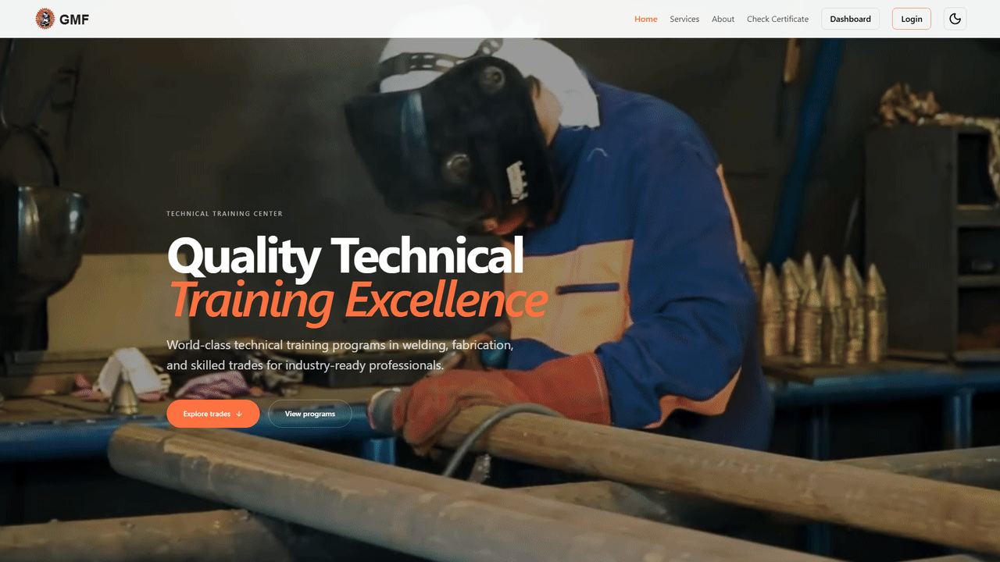
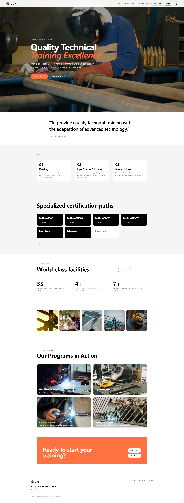

# 🏭 GMF Training Center — Welder Certification Platform

> A modern welder qualification certificate verification and management system. Built with **React 19**, **Vite 8**, **Tailwind CSS v4**, and **Laravel 12** with real-time certificate data integration.

<p align="center">
  <a href="#"></a>
  <a href="#"></a>
  <a href="#"></a>
  <a href="#"></a>
  <a href="#"></a>
</p>

<p align="center">
  
</p>

<!-- <p align="center">
  
</p> -->

---

## 🚀 Features

| Feature                           | Details                                                  |
| --------------------------------- | -------------------------------------------------------- |
| 🌓 **Dark / Light Mode**          | `next-themes` + Tailwind v4 with persistent theme choice |
| 📋 **Certificate Verification**   | Public search by certificate number or welder ID         |
| 🔐 **Secure Certificate Details** | Full WQT records (owner/admin only with authentication)  |
| 🔑 **User Authentication**        | Laravel Sanctum personal access tokens                   |
| 👤 **User Profile Management**    | Update profile fields, change password                   |
| 📊 **Admin Dashboard**            | CRUD management for products, services, pricing plans    |
| 🔄 **Mock/API Data Switching**    | Dual deployment modes with automatic fallback            |
| 📱 **Fully Responsive**           | Mobile, tablet, and desktop optimized                    |
| 🎯 **Compact WQT Display**        | Modern table layout with side-by-side test sections      |
| ⚡ **Preview Mock Data**          | View full certificate details without authentication     |

---

## 📖 What is This?

**GMF Training Center** is a welder qualification certificate verification platform that allows:

1. **Public Users**: Search and preview welder certificates by certificate number or welder ID
2. **Authenticated Users**: View full certificate details including WQT (Welder Qualification Test) records
3. **Admins**: Manage all certificates and user access
4. **Staff**: Dashboard access for managing training materials and certification data

The platform integrates with **Laravel 12 backend** for real certificate data storage and authentication, with **mock data fallback** for demo/development modes.

---

## 🏗️ Architecture

This project consists of **two independent repositories**:

| Repository    | Purpose               | Tech Stack                    |
| ------------- | --------------------- | ----------------------------- |
| `gmf-web`     | React + Vite frontend | React 19, Vite 8, Tailwind v4 |
| `gmf-backend` | Laravel REST API      | Laravel 12, PHP 8.2+, MySQL   |

### Deployment Modes

| Mode               | Env Var                 | Data Source              | Requires Backend? |
| ------------------ | ----------------------- | ------------------------ | ----------------- |
| **A — Mock/Demo**  | `VITE_DATA_SOURCE=mock` | Local JS mock data       | No                |
| **B — Production** | `VITE_DATA_SOURCE=api`  | Laravel REST API + MySQL | Yes               |

### Mock Data Fallback

API mode falls back to local mock data when the backend cannot be reached or returns a server error. Normal API responses such as not-found and authorization errors are shown instead of being replaced with mock data.

---

## 🔐 Authentication & Authorization

Current implementation:

- ✅ **User Registration** — `POST /api/register`
- ✅ **User Login** — `POST /api/login`
- ✅ **Get Current User** — `GET /api/user` (protected)
- ✅ **Logout** — `POST /api/logout` (protected)
- ✅ **Update Profile** — `PUT /api/user/profile` (protected)
- ✅ **Change Password** — `PUT /api/user/password` (protected)
- ✅ **Certificate Verification** — Public preview + authenticated details view
- ✅ **Role-Based Access** — Owner/Admin authorization on sensitive data

---

## 📡 API Routes

All routes use the `/api` prefix. For local development, the base URL is `http://localhost:8000/api`.

### Authentication

Public routes do not need a token. For protected routes, send the Sanctum token returned by `POST /api/login`:

```http
Authorization: Bearer <token>
Accept: application/json
Content-Type: application/json
```

| Method | Route                | Access    | Purpose                                                           |
| ------ | -------------------- | --------- | ----------------------------------------------------------------- |
| `POST` | `/api/register`      | Public    | Create a user account; new registrations receive the `user` role. |
| `POST` | `/api/login`         | Public    | Authenticate and return a user plus bearer token.                 |
| `GET`  | `/api/user`          | Signed in | Get the current user.                                             |
| `POST` | `/api/logout`        | Signed in | Revoke the current token.                                         |
| `PUT`  | `/api/user/profile`  | Signed in | Update profile fields.                                            |
| `PUT`  | `/api/user/password` | Signed in | Change the current password.                                      |

### Certificate Routes

Certificate previews are public. Full details and PDF metadata require authentication and certificate ownership, or the `admin` role. `GET /api/user/certificates` returns certificates owned by the signed-in user.

| Method | Route                                                          | Access         | Purpose                                                                                        |
| ------ | -------------------------------------------------------------- | -------------- | ---------------------------------------------------------------------------------------------- |
| `GET`  | `/api/certificates/preview/{certificateNo}`                    | Public         | Return safe preview fields for one certificate.                                                |
| `GET`  | `/api/certificates/search?welder_identification_no={welderId}` | Public         | Find preview records by welder ID.                                                             |
| `GET`  | `/api/certificates/{certificateNo}/detail`                     | Owner or admin | Return the complete certificate record.                                                        |
| `GET`  | `/api/certificates/{certificateNo}/pdf`                        | Owner or admin | Check PDF availability. Currently returns placeholder JSON; file streaming is not implemented. |
| `GET`  | `/api/user/certificates`                                       | Signed in      | List the current user's certificates.                                                          |
| `POST` | `/api/admin/certificates/{id}/link-user`                       | Admin          | Assign a certificate to a user. JSON body: `{"user_id": 2}`.                                   |

Certificate numbers contain `/`, so URL-encode the full number in the path. For example, `GMF/WQT/AWS/0612` becomes `GMF%2FWQT%2FAWS%2F0612`:

```bash
curl "http://localhost:8000/api/certificates/preview/GMF%2FWQT%2FAWS%2F0612"
curl "http://localhost:8000/api/certificates/search?welder_identification_no=GMF-533"
```

### Dashboard Resource Routes

Products, services, and pricing use the same REST pattern. Replace `{resource}` with `products`, `services`, or `pricing`; `{id}` is the numeric database ID. Every route in this section requires a bearer token.

| Method           | Route                  | Purpose          |
| ---------------- | ---------------------- | ---------------- |
| `GET`            | `/api/{resource}`      | List records.    |
| `GET`            | `/api/{resource}/{id}` | Get one record.  |
| `POST`           | `/api/{resource}`      | Create a record. |
| `PUT` or `PATCH` | `/api/{resource}/{id}` | Update a record. |
| `DELETE`         | `/api/{resource}/{id}` | Delete a record. |

Examples: `GET /api/products/3`, `POST /api/services`, `PATCH /api/pricing/2`.

Resource responses wrap records in a `data` property. For example, `GET /api/products` returns `{ "data": [...] }`.

### Health Check

| Method | Route         | Access | Purpose                               |
| ------ | ------------- | ------ | ------------------------------------- |
| `GET`  | `/api/health` | Public | Check that the backend is responding. |

---

## ⚡ Quick Start

### Frontend Only (Mock Mode)

```bash
# Install dependencies
npm install

# Start dev server (uses mock data)
npm run dev

# Build for production
npm run build

# Preview build
npm run preview
```

### Full Stack (API Mode)

**Prerequisites:**

- PHP 8.2+, Composer, MySQL
- Laravel backend repository: `gmf-backend`

**Backend Setup:**

```bash
# Navigate to backend directory
cd gmf-backend

# Install dependencies
composer install

# Setup environment
cp .env.example .env
php artisan key:generate

# Configure database in .env
# DB_DATABASE=gmf
# DB_USERNAME=your_username
# DB_PASSWORD=your_password

# Run migrations
php artisan migrate

# Seed sample data (optional)
php artisan db:seed

# Start Laravel server
php artisan serve
# Runs on http://localhost:8000
```

**Frontend Setup:**

```bash
# Navigate to frontend directory
cd gmf-web

# Install dependencies
npm install

# Create .env file
echo "VITE_DATA_SOURCE=api" > .env
echo "VITE_API_URL=/api" >> .env
echo "VITE_API_TIMEOUT=2000" >> .env

# Start Vite dev server
npm run dev
# Runs on http://localhost:5173
# Proxies /api requests to backend automatically
```

---

## 🌍 Environment Variables

### Frontend (.env)

```env
# Data source mode
VITE_DATA_SOURCE=mock          # Use mock data (no backend required)
VITE_DATA_SOURCE=api           # Use Laravel API

# API configuration (only needed in API mode)
VITE_API_URL=/api              # Local dev (proxied to localhost:8000)
VITE_API_URL=https://api.example.com/api  # Production backend
VITE_API_TIMEOUT=2000          # Request timeout in milliseconds
```

**Note:** Vite dev server automatically proxies `/api` requests to `http://localhost:8000` for local development.

---

## 📁 Project Structure

```
src/
  components/     — reusable UI components
    ui/           — generic UI (Button, Card, Badge, Input)
    navigation/   — Navbar, Sidebar, Tabs, Breadcrumb
    feedback/     — Modal, Toast, Loading, EmptyState
  pages/          — complete pages
    landing/      — landing page
    auth/         — login, register, forgot password
    dashboard/    — dashboard pages
    certificate/  — certificate verification page
    error/        — 404, unauthorized pages
  layouts/        — reusable page layouts
  services/       — API integration layer
    api/          — auth.js, products.js, services.js, pricing.js, certificates.js, config.js
    data.js       — data source abstraction with mock fallback
  context/        — React context (AuthContext for auth state)
  hooks/          — custom React hooks
  lib/            — utilities and helper functions
  data/           — static/mock data (exampleData.js)
```

---

## 🛠 Tech Stack

### Frontend

| Layer      | Technology          |
| ---------- | ------------------- |
| Framework  | React 19            |
| Build Tool | Vite 8              |
| Styling    | Tailwind CSS v4     |
| Routing    | react-router-dom v7 |
| Icons      | Lucide React        |
| Theme      | next-themes         |
| State      | React Context API   |

### Backend

| Layer          | Technology           |
| -------------- | -------------------- |
| Framework      | Laravel 12           |
| Language       | PHP 8.2+             |
| Database       | MySQL                |
| Authentication | Laravel Sanctum ^4.3 |
| API            | RESTful JSON API     |

---

## 🚀 Deployment

### Vercel (Mock Mode Demo)

Deploy frontend-only to Vercel without backend:

```bash
# Build for production
npm run build

# Deploy to Vercel
vercel deploy
```

**Environment Setup on Vercel:**

- Leave `VITE_DATA_SOURCE` unset (defaults to mock)
- No API configuration needed
- Dashboard automatically uses mock data

Perfect for demos and portfolio showcases.

### Production (API Mode)

For full-stack deployment with Laravel backend:

1. **Deploy Backend**: Follow deployment guide in `gmf-backend` repository
2. **Configure Frontend Environment**:
   ```env
   VITE_DATA_SOURCE=api
   VITE_API_URL=https://api.yourdomain.com/api
   VITE_API_TIMEOUT=5000
   ```
3. **Configure CORS**: Set `FRONTEND_URL` in backend `.env` to match frontend domain
4. **Deploy Frontend**: Build and deploy to hosting provider

See `PROJECT_PLAN.md` → "Deployment" section for detailed instructions.

---

## 📖 Usage Examples

### Search for Certificate

1. Navigate to `/certificate`
2. Enter certificate number (e.g., `GMF/WQT/AWS/0612`) or welder ID (e.g., `GMF-533`)
3. View preview information (public, no auth required)
4. Click "Preview Mock Data" or "Log In" to see full details

### Full Certificate Details (Authenticated)

1. Log in with credentials
2. Search for certificate
3. Click "View Full Details"
4. See complete WQT record including:
   - Certificate Information
   - Qualification parameters
   - Visual Examination results
   - Guide Bend Test results
   - Mechanical Test data
   - Ultrasonic Test results
   - Welding Supervision info
   - Organization signatures

### Admin Dashboard

1. Log in as admin
2. Navigate to `/dashboard`
3. Access CRUD sections:
   - Products
   - Services
   - Pricing Plans
4. Create, read, update, delete items
5. Changes sync to database via API

---

## 📊 Development Status

### Completed Phases (0-19)

- ✅ Phase 0-7: Project setup, Laravel API, React integration, CRUD operations
- ✅ Phase 8-17: Full authentication system, protected routes, token management
- ✅ Phase 18: Certificate Management System with WQT records
- ✅ Phase 19: Certificate UI enhancements with compact display

See `PROJECT_PLAN.md` for detailed phase-by-phase progress.

---

## 🔗 Related Documentation

- **PROJECT_PLAN.md** — Detailed project roadmap, phase implementation notes, architectural decisions
- **gmf-backend** — Separate repository for Laravel REST API

---

## 🧪 Testing

### Verify Current State

```bash
# Frontend
cd gmf-web
npm run dev
# Visit http://localhost:5173
# Check: Landing page loads, certificate search works
# Check: Dashboard accessible (authenticated)
# Check: Dark mode toggle works

# Backend
cd gmf-backend
php artisan test
curl http://localhost:8000/api/health
curl http://localhost:8000/api/certificates/search?welder_identification_no=GMF-533
```

### Test Certificate Search

**Mock Mode:**

- Certificate No: `GMF/WQT/AWS/0612`
- Welder ID: `GMF-533`

**Database:**

- Requires backend running with `php artisan migrate` and `php artisan db:seed`

---

## 📄 License

Private project — built for welder certification and training management.

---

**Built with ❤️ using React 19, Vite 8, Tailwind CSS v4, Laravel 12, and Sanctum**
